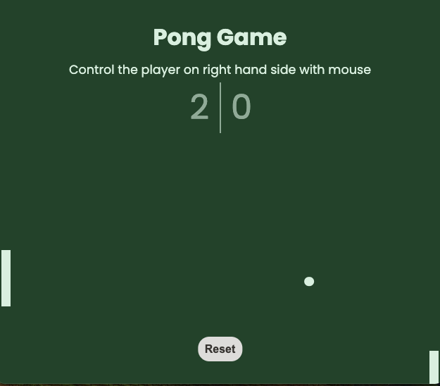

## Pong Game

### The challenge:

Building a pong game with HTML, CSS and JavaScript.

### Screenshot:

### How does the app work?

Pong is a classic arcade game that simulates table tennis. The bot and player have control of a paddle on either side of the scrren and use them to hit a ball back and forth. You score points whenever you hit the ball.

### Process

- Create draft of README file
- Create .gitignore file
- Create Github repository
- Work on HTML, CSS and JS files
- Check final code and accessibility
- Finalize README file
- Publish live URL

### What I learned along the way

- Animation with requestAnimationFrame
- Collision detection with getBoundingClientRect
- Object-Oriented Programming by creating Ball and Paddle classes
- Positioning the paddles

### Additional features to add later...

- Confetti and shoutout text if player wins after a certain time
- Make sure the bot loses once in a while
- Smoother movement of player paddle
- Use arrow keys to control player paddle rather than mouse
- Hide the instructions when the game begins
